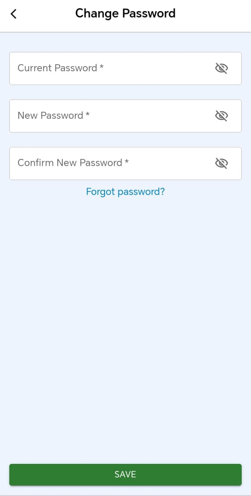

# Administrador de Perfil de Usuario

## Descripción

Este proyecto es una aplicación full stack que combina **React** con **TypeScript** para el frontend y **Node.js** con **Express** para el backend. La aplicación permite a los usuarios gestionar su perfil y autenticarse. Está organizada en dos secciones principales:

- **`client`**: Interfaz de usuario construida con React y TypeScript.
  - **Características**:
    - Cambiar el nombre y apellidos del usuario.
    - Cambiar el nombre de usuario.
    - Cambiar la contraseña.
    - Iniciar sesión.
  - **Tecnologías**:
    - **Tailwind CSS** y **Material UI** para el diseño.
    - **Zustand** para el manejo del estado global.
    - **Axios** para la gestión de solicitudes HTTP.

    
    

- **`server`**: Lógica del servidor y la API utilizando Node.js y Express.
  - **Características**:
    - Manejo de usuarios.
    - Autenticación y autorización.
    - Gestión de contraseñas.
  - **Tecnologías**:
    - **Node.js** y **Express** para la gestión del servidor.
    - **MongoDB** con **Mongoose** para la base de datos.

## Prerrequisitos

- **Navegador Web** (Chrome, Firefox, etc.).
- **Node.js** v20 o posterior.

## Instalación y Ejecución del Proyecto

### Clonar el Repositorio

Clona el repositorio en tu máquina local:

```bash
git clone https://github.com/Iv44n/user-mgmt.git
```

### Instalar Dependencias

Accede a cada carpeta del proyecto para instalar las dependencias necesarias:

1. **Frontend (React)**:

   ```bash
   cd client
   npm install
   ```

2. **Backend (Node.js)**:

   ```bash
   cd ../server
   npm install
   ```

### Configurar Variables de Entorno

Accede a la carpeta `server` y crea un archivo `.env` para definir las variables de entorno necesarias:

- **`MONGODB_URI`**: URL de conexión a la base de datos MongoDB.
- **`PORT`**: Puerto en el que el servidor escuchará las solicitudes.

Ejemplo de archivo `.env`:

```
MONGODB_URI=mongodb://localhost:27017/tu-base-de-datos
PORT=5000
```

### Configurar Proxy para la API en Vite

Accede a la carpeta `client` y crea o modifica el archivo `vite.config.ts` para configurar el proxy para la API:

```typescript
import { defineConfig } from 'vite'
import react from '@vitejs/plugin-react-swc'

// https://vitejs.dev/config/
export default defineConfig({
  plugins: [react()],
  server: {
    proxy: {
      '/api': {
        target: 'http://localhost:5000', // Reemplaza con la dirección de tu API
        changeOrigin: true,
      },
    },
  },
})
```

## Uso

Para iniciar el proyecto, sigue estos pasos:

1. **Iniciar el backend**:

   Navega a la carpeta `server` y ejecuta:

   ```bash
   npm run dev
   ```

2. **Iniciar el frontend**:

   Navega a la carpeta `client` y ejecuta:

   ```bash
   npm run dev
   ```

El frontend estará disponible en `http://localhost:5173` y el backend en `http://localhost:5000` (o el puerto configurado en las variables de entorno).

## Ejemplos en videos (haz click en la imagen para reproducirla)

**para reproducir el video, se recomienda hacerlo localmente despues de clonar el repositorio**

### Login

[](./assets/login.mp4 'Login')

Por defecto, el formulario de inicio de sesión muestra el usuario `admin` y la contraseña `admin`. No se puede crear otro usuario diferente.

### Cambiar Nombre y Apellidos

[](./assets/changeName.mp4 'Change Name')

### Cambiar Nombre de Usuario

[](./assets/changeUsername.mp4 'Change Username')

### Cambiar Contraseña

[](./assets/changePassword.mp4 'Change Password')

La aplicación tiene funcionalidades para manejar contraseñas y usuarios tanto en el servidor como en el frontend. A medida que interactúas con ella, podrás descubrir más características y opciones.